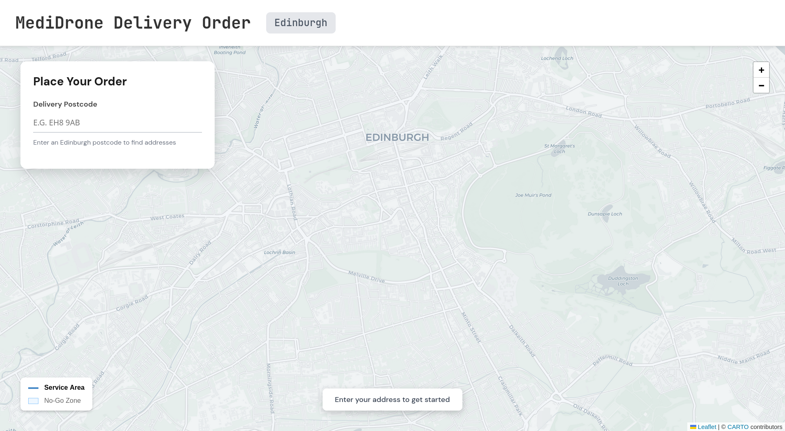
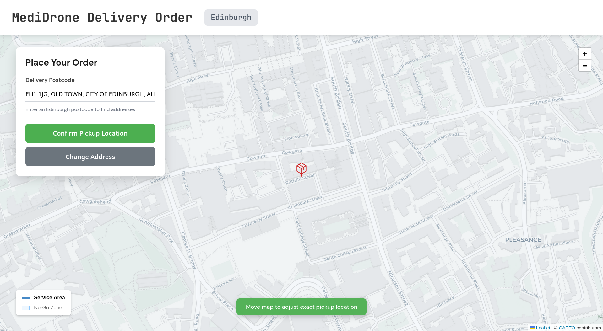
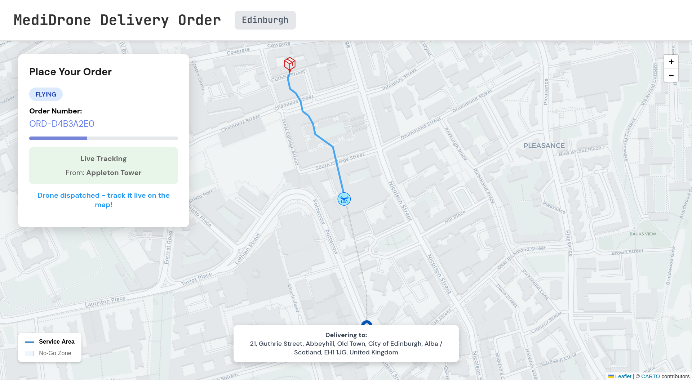
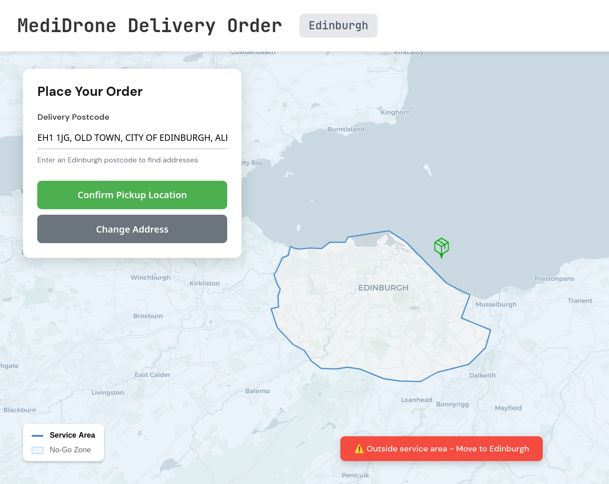
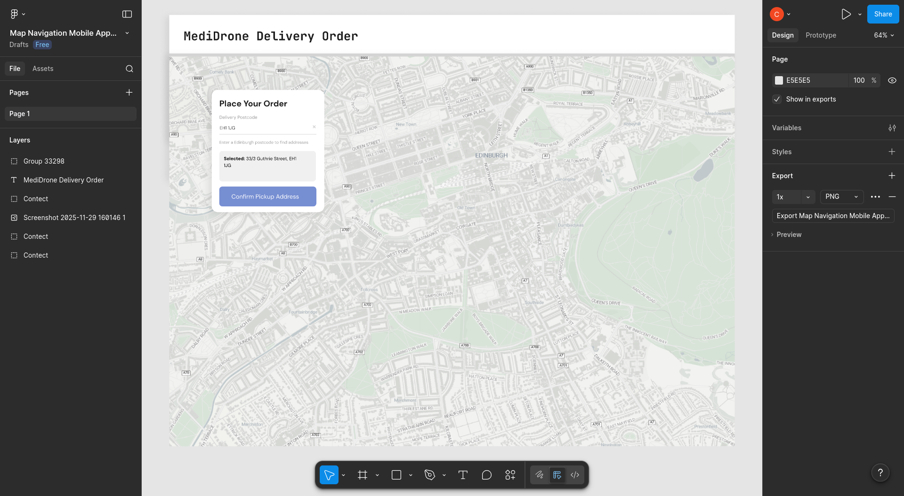

# Demo Walkthrough

<!--## Video Demo-->
<!-- Uncomment when you have the video/GIF -->
<!--  -->
<!-- Or link to YouTube: [Watch Demo](https://youtube.com/...) -->

---

## Step-by-Step Flow

### 1. Home Screen
Enter an Edinburgh postcode (e.g., `EH8 9AB`) and select a medication.

### 2. Address Selection
Choose from autocomplete suggestions. Fine-tune location by dragging the map under the pin.

### 3. Order Placed & Drone Dispatched
Path is calculated using A* algorithm, avoiding no-fly zones. Drone departs from nearest service point.

### 4. Real-Time Tracking
- Blue line = remaining path
- Grey line = completed path
- Drone marker updates every 250ms via WebSocket

### 5. Arrival & Collection
Drone arrives, user confirms pickup, drone returns to service point.

---

## Video Demo

To watch, copy and past the link into your browser.

Short demo video: https://drive.google.com/file/d/1KJRT5VYBnB8M96CHsaEUslB64rbR-8t9/view?usp=drive_link

Long demo video: https://drive.google.com/file/d/137au4n9-pL1asmucqdMPWmdw7AyM3JrI/view?usp=drive_link

## Edge Cases Handled

### Outside Service Area
Users cannot place markers outside Edinburgh boundary - immediate visual feedback.

---

## Design Process

### Initial Figma Mockup
UI inspired by Deliveroo's delivery tracking interface.

